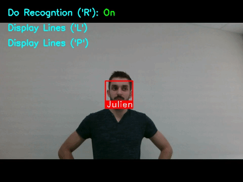

## A - Facial Detection & Extraction & Aligment

Performs two steps:
1. Detection of one or more faces in an image by using dlib ;
2. Extraction and alignment of the faces: the face aligned by taking care of the eyes position

## B - Facial Recognition

Uses the previous face detection and recognize a person within a dataset.
Here, just 1 image is used by person.

To add a new face in the dataset, add the corresponding *.jpg* file in the *data/images/* folder.

To see a practical example of the method used, please refer to my other repo 